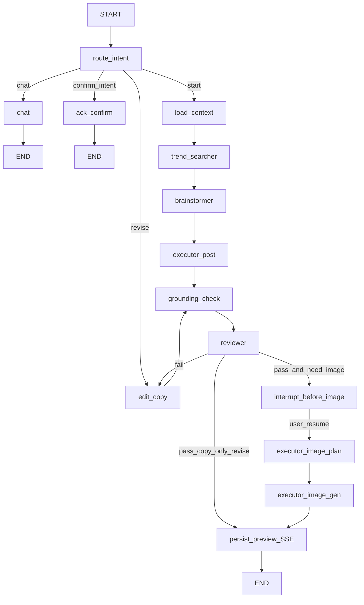

# Unhinted Marketing Agent — Roadmap

> **Stack:** Python (FastAPI) · LangGraph · PostgreSQL (+ pgvector) · React (Tailwind + shadcn/ui)  
> **Market focus (MVP):** Hong Kong hot search & trends  
> **Product model:** Backend autopilot for signals + user-guided session for content → preview → confirm post

---

## Vision

An AI marketing assistant that **continuously scans HK market signals** (Google Trends in MVP; Meta Graph API in Phase 3), surfaces **actionable content recommendations** tied to company profile and personas, and guides users through **iterative preview** until they confirm—at which point posts go out via **traditional platform APIs** (no LLM involved in publish).

---

## Architecture Principles

| Principle | Decision |
|-----------|----------|
| LLM boundary | LangGraph owns **chat → recommend → preview edit loop** only |
| Confirm / publish | **Traditional HTTP handler** — validate token, call platform API, write receipt. Zero LLM. |
| Autopilot vs session | Hot search & question batch = **background workers**; preview = **on-demand session** |
| Grounding | All factual claims cite `source_signal_ids` verifiable in PostgreSQL |
| BYOK | LiteLLM routes cheap models (scan/summary) vs strong models (strategy/reviewer) |
| Knowledge | PostgreSQL only — signals, topics, personas, graph edges in JSONB |
| Preview | **Revision chain** — user can keep requesting edits until satisfied |
| Auth boundary | **JWT access + refresh**; all session APIs require authenticated user; Confirm validates user owns session |

---

## User System & Authentication

### Model

```
users ──< organization_members >── entities (type=company)
  │
  └──< sessions (user_id, company_id)
```

| Table | Purpose |
|-------|---------|
| `users` | Account: email (unique), password_hash, display_name, is_active |
| `organization_members` | Multi-tenant RBAC: user ↔ company entity, role (`owner` \| `admin` \| `member`) |
| `refresh_tokens` | Hashed refresh token family (rotation + revoke on logout) |

**MVP scope:** email/password login; one default company per new user (auto-created `entities` row + `organization_members` as `owner`). OAuth (Google / Meta) deferred to Phase 4.

### API (`/auth/*`)

| Method | Path | Notes |
|--------|------|-------|
| POST | `/auth/register` | Create user + default org; returns tokens |
| POST | `/auth/login` | Email/password → access + refresh JWT |
| POST | `/auth/refresh` | Rotate refresh token; new access token |
| POST | `/auth/logout` | Revoke refresh token family |
| GET | `/auth/me` | Current user + org memberships |

Access token: **15 min** (Bearer header). Refresh token: **7 days** (httpOnly cookie in browser; body for CLI).

### Frontend Login Panel

- Route: `/login` (public) · `/register` (public) · `/` (protected dashboard shell)
- shadcn/ui Card + Form; email/password; error toasts
- Auth context stores access token (memory); refresh via cookie on 401
- Unauthenticated users redirected to `/login`

### Security Defaults

- Passwords: **argon2** via passlib
- JWT signed with `JWT_SECRET` (min 32 bytes in prod)
- Rate limit login/register (Redis or in-memory MVP)
- `sessions.user_id` must match authenticated user on all session endpoints

---

## System Modes (User-Facing)

```
┌─────────────────────────────────────────────────────────────────┐
│  Login / Register                                               │
│  • Email + password · JWT session                               │
└────────────────────────────┬────────────────────────────────────┘
                             ▼
┌─────────────────────────────────────────────────────────────────┐
│  Landing (Chat Mode entry)                                      │
│  • Recommended questions (JSON, cached ~12h)                    │
│  • Based on: company profile + hot search + personas            │
│  • User picks a question or free-form chat                      │
│  • Build order: Landing UI after Chat shell + Agent UI          │
└────────────────────────────┬────────────────────────────────────┘
                             ▼
┌─────────────────────────────────────────────────────────────────┐
│  Chat Mode (discussion)                                         │
│  • Free-form Q&A via `chat` node                                │
│  • Assistant text streams token-by-token over SSE               │
│    (`message.delta` → final `message.assistant`)                │
│  • UI: Streamdown for streaming + final markdown (zh-HK CJK)    │
└────────────────────────────┬────────────────────────────────────┘
                             ▼
┌─────────────────────────────────────────────────────────────────┐
│  Agent Mode                                                     │
│  • trend_searcher surfaces relevant HK signals                  │
│  • brainstormer: can_do[] / cannot_do[] + brief ideas           │
│  • executor_post: brief → grounded post copy                     │
│  • User OK → executor_image_plan → executor_image_gen → Preview │
│  • UI: `agent.progress` status (node + model tier/id) — do not  │
│    stream structured JSON as chat markdown; then brief cards    │
└────────────────────────────┬────────────────────────────────────┘
                             ▼
┌─────────────────────────────────────────────────────────────────┐
│  Preview Mode (iterative)                                       │
│  • Layout: left chat (narrow) · right preview (wide)            │
│  • User keeps requesting edits until satisfied                  │
│  • Each edit → new revision → reviewer gate → SSE update        │
│  • Chat "可以出" ≠ publish — UI Confirm button only           │
└────────────────────────────┬────────────────────────────────────┘
                             ▼
┌─────────────────────────────────────────────────────────────────┐
│  Confirm (NO LangGraph, NO LLM)                                 │
│  POST /sessions/{id}/confirm                                    │
│  • Read latest preview_draft · validate approval_token          │
│  • Platform API (Meta/IG/etc.) · idempotency_key · receipt      │
└─────────────────────────────────────────────────────────────────┘
```

**Phase 3 UI build order:** Chat shell → chat token stream → Agent progress/brief UI → Landing cards → Preview + Confirm.

**Frontend chat stack:** hand-rolled React session client (`useSession` + `fetch` SSE with Bearer). No Vercel AI SDK `useChat`. Assistant markdown via standalone [Streamdown](https://streamdown.ai/) + `@streamdown/cjk`.
---

## LangGraph Scope

LangGraph implements the **Session LLM Zone** only. **`preview` is not a graph node** — it is a mode + persist side-effect after image gen (or after a copy-only revise passes review): write `preview_drafts`, set `mode=PREVIEW`, emit SSE.

```
nodes:
  control:     route_intent · load_context · chat · ack_confirm
  research:    trend_searcher          # session on-demand PG signal lookup (not background ingest)
  strategy:    brainstormer            # brief ideas, can_do[] / cannot_do[], angles
  execute:     executor_post           # brief → publish-ready post copy
               executor_image_plan     # post + brand context → image prompt / layout spec
               executor_image_gen      # dispatch image worker (no LLM; async job)
  revise:      edit_copy
  quality:     grounding_check · reviewer

checkpoint: PostgreSQL LangGraph checkpointer (PostgresSaver);
            thread_id = session.id; checkpoint tables owned by checkpointer setup
            (not hand-written into Alembic app migrations)

NOT in graph: hot_search_worker · question_generator · DALL-E worker · POST /confirm ·
              platform adapters · preview (mode + persist_preview side-effect)
```

### Edge map

```
START → route_intent
  ├── chat            → chat → END
  ├── start           → load_context → trend_searcher → brainstormer → executor_post
  │                     → grounding_check → reviewer
  ├── revise          → edit_copy → grounding_check → reviewer
  └── confirm_intent  → ack_confirm → END   # sets pending_confirm; does NOT publish

reviewer:
  ├── fail            → edit_copy (with reviewer_feedback)
  │                     → grounding_check → reviewer
  │                     (max_review_retries=2; exceed → END + error SSE)
  ├── pass + need_image (first AGENT draft, or revise that changes image)
  │                     → interrupt_before executor_image_plan
  │                     → (user resume via POST /messages)
  │                     → executor_image_plan → executor_image_gen
  │                     → persist_preview (mode=PREVIEW, SSE) → END
  └── pass + copy_only revise
                        → persist_preview (mode=PREVIEW, SSE) → END
```



**Intent routing (`route_intent` outputs):**

| Intent | When |
|--------|------|
| `chat` | No draft / still in conversational landing; free-form Q&A |
| `start` | User picks a recommended question or explicitly asks for content |
| `revise` | `mode=PREVIEW` and user requests copy/image edits |
| `confirm_intent` | User says publish-like phrases (e.g. 「可以出」); only ack — UI Confirm button publishes |

### Interrupts

- Compile with **`interrupt_before=["executor_image_plan"]`**.
- First AGENT path: after `reviewer` pass → checkpoint pauses before image plan.
- Resume: next authenticated `POST /messages` on the same session (`thread_id = session.id`) continues into `executor_image_plan`.
- Copy-only revise that does not need a new image skips the interrupt and goes to `persist_preview`.

### State

```text
messages              # chat transcript
mode                  # CHAT | AGENT | PREVIEW
company_id, user_id, thread_id
brief                 # brainstormer output (can_do[], cannot_do[], angles, persona)
draft                 # post copy (caption, hashtags, CTA)
image_plan            # structured image prompt / composition
image_url             # placeholder/local path in Phase 2; S3 in Phase 4
revision              # integer revision counter
source_signal_ids     # grounding citations
reviewer_feedback     # last fail reasons (or empty on pass)
review_attempts       # retries toward max_review_retries=2
pending_confirm       # set by ack_confirm; Confirm handler checks this + approval_token
approval_token        # per-revision token written with preview_drafts
need_image            # bool — route reviewer → interrupt vs copy-only persist
```

### Nodes

| Node | Type | Writes | SSE (if any) |
|------|------|--------|--------------|
| `route_intent` | LLM / classifier | intent | — |
| `load_context` | deterministic | company/persona context on state | — |
| `trend_searcher` | tool + LLM (cheap) | `source_signal_ids`, ranked signals | `signals.updated` |
| `chat` | LLM (stream) | `messages` | `message.delta` (tokens) → `message.assistant` |
| `brainstormer` | LLM (medium) | `brief`, `mode=AGENT` | `agent.progress` → `brief.updated` |
| `executor_post` | LLM (medium) | `draft` | `agent.progress` → `draft.copy_updated` |
| `executor_image_plan` | LLM (medium) | `image_plan` | `agent.progress` → `draft.image_plan_updated` |
| `executor_image_gen` | async dispatch | `image_url` | `draft.image_pending` → `draft.updated` |
| `edit_copy` | LLM (medium) | `draft`, clear/adjust `need_image` | `agent.progress` → `draft.copy_updated` |
| `grounding_check` | deterministic | pass/fail on `source_signal_ids` | — |
| `reviewer` | LLM (strong) | `reviewer_feedback`, `review_attempts` | `agent.progress` → `review.completed` |
| `ack_confirm` | LLM (cheap) | `pending_confirm=true` | `confirm.pending` |
| *(side-effect)* `persist_preview` | deterministic | `preview_drafts` row, `mode=PREVIEW`, `approval_token`, `revision++` | `preview.updated` |

---

## Tech Stack

| Layer | Choice | Notes |
|-------|--------|-------|
| API | FastAPI + uvicorn | REST + SSE for preview updates |
| Auth | JWT (python-jose) + argon2 | Access/refresh; httpOnly refresh cookie |
| Workers | Python (`cmd/worker`, `cmd/scheduler`) | ARQ + Redis when provisioned; PG job queue fallback |
| Agent | LangGraph + LiteLLM | Structured output via Pydantic |
| DB | PostgreSQL 16+ | pgvector for signal similarity (MVP) |
| Cache / queue | Redis (optional MVP) | Question cache, job queue, rate limits |
| Media | Placeholder / local path (Phase 2); S3 (Phase 4) | Phase 2 stores URL string on `preview_drafts`; archive later |
| Frontend | React + Vite + Tailwind + Streamdown | Session UI; Streamdown for streaming MD; shadcn optional later |
| Hot search | pytrends / SerpAPI | Meta Graph API Phase 3 |

---

## Repository Layout (Target)

```
unhinted-marketing/
├── cmd/
│   ├── api/                 # FastAPI entrypoint (+ /auth routes)
│   ├── worker/              # ARQ / async job consumer
│   └── scheduler/           # Cron: hot_search, question_gen
├── internal/
│   ├── auth/                # JWT, password, deps, refresh tokens
│   ├── perception/          # hot_search, news_scanner, news_promoter
│   ├── session/             # LangGraph graph, nodes, checkpointer
│   ├── reasoning/           # reviewer helpers, planner (Phase 5 autopilot)
│   ├── tools/               # query_market_trends, publish adapters (stubs → real)
│   ├── memory/              # PG repos, pgvector, persona seed
│   ├── reliability/         # validator, budget breaker, hallucination check
│   └── llm/                 # LiteLLM router, BYOK config
├── schemas/                 # JSON Schema + Pydantic models
├── migrations/              # PostgreSQL (Alembic)
├── web/                     # React dashboard + login panel
└── docs/
    └── ROADMAP.md           # this file
```

---

## PostgreSQL Schema (Core Tables)

| Table | Purpose |
|-------|---------|
| `users` | Auth accounts (email, password_hash, display_name) |
| `organization_members` | User ↔ company RBAC |
| `refresh_tokens` | Rotating refresh token store (hashed) |
| `raw_news_events` | Every ingested item (url, excerpt, url_hash, signal_id) |
| `entities` | brands, topics, personas, campaigns, **companies** (`profile` JSONB) |
| `edges` | MENTIONS, AFFECTS, TARGETS, PERFORMED_ON + source_signal_id |
| `campaigns` | Operational campaign state |
| `sessions` | User session state (mode, company_id, **user_id**) |
| `session_messages` | Chat log (left panel) |
| `preview_drafts` | Revision chain (copy, image, platform, approval_token) |
| `tool_receipts` | Idempotent execution receipts |
| `byok_config` | Encrypted provider keys (server-side only) |
| `recommended_questions` | Cached 12h batch JSON |

---

## Knowledge (PostgreSQL)

All curated marketing knowledge lives in PostgreSQL — no markdown bundle in repo.

| Store | Contents |
|-------|----------|
| `raw_news_events` | Ingested HK signals (title, excerpt, metrics, provenance) |
| `entities` (type `topic`) | Promoted hot-search topics (`profile` JSONB) |
| `entities` (type `persona`) | Marketing personas (`profile` JSONB; seeded defaults) |
| `edges` | Graph links (`AFFECTS`, etc.) with `source_signal_id` |

Personas are seeded on first question generation; promoted topics are created by the `promote` worker.

## Hot Search Sources (Phased)

| Phase | Source | Method |
|-------|--------|--------|
| MVP | Google Trends HK | pytrends / SerpAPI |
| P3 | Meta trending / insights | Graph API (business account) |

Google News RSS was evaluated and **removed** — poor HK relevance, redirect URLs, not true hot search. No news RSS in future phases.

All metrics stored in PG with provenance before LLM reads them.

---

## External Tools (Schema-Validated)

1. **`query_market_trends`** (read-only) — background worker + `trend_searcher` node in session  
2. **`publish_social_post`** — called only from Confirm handler, not LangGraph  
3. **`launch_ad_campaign`** — Phase 3, requires `approval_token` + atomic budget cap  

---

## Safety (Immutable Policy)

- Max daily ad spend & publish rate limits  
- Topic/region blocklists  
- `approval_token` required per preview revision before Confirm enabled  
- Read-only degradation when reviewer confidence below threshold  
- Outbound claims must cite verifiable `source_signal_ids`  
- Session endpoints enforce `user_id` ownership  

---

## Phase Plan

### Phase 0 — Project Bootstrap ✅

- [x] Git repository initialized
- [x] `docs/ROADMAP.md`
- [x] User system design (users, org members, JWT auth)
- [x] `.env.example` (dev DB at `192.168.5.20:5434`)
- [x] Python project skeleton (`pyproject.toml`, `cmd/`, `internal/`)
- [x] Auth API: register, login, refresh, logout, me
- [x] Alembic migration: `users`, `organization_members`, `refresh_tokens`
- [x] React login panel (`web/`) — `/login`, `/register`, auth context
- [x] Minimal README (+ GETTING_STARTED for dev setup)

### Phase 1 — Data & Autopilot Backend ✅

**Goal:** Background ingestion + landing-page question cache; no UI yet (CLI/logs).

- [x] PostgreSQL migrations: `raw_news_events`, `entities`, `edges`, `recommended_questions`
- [x] `hot_search_worker` — Google Trends HK → PG
- [x] `question_generator_worker` — company profile + signals → JSON, cache 12h
- [x] LiteLLM BYOK config loader
- [x] Default personas in `entities` (type=persona, seeded on first use)
- [x] `news_promoter` worker — threshold → topic entity + edge in PG

**Exit criteria:** CLI shows top HK signals; cached recommended questions JSON served via API.

### Phase 2 — LangGraph Session + API

**Goal:** Full chat → agent → iterative preview loop; Confirm stubbed. HK signals from Google Trends (Phase 1) until Meta ingest lands in Phase 3.

- [x] Migrations: `sessions`, `session_messages`, `preview_drafts`, `tool_receipts`
- [x] LangGraph graph: CHAT → AGENT → PREVIEW (revise loop) + PostgreSQL checkpointer (`thread_id = session.id`)
- [x] Session nodes: `route_intent`, `load_context`, `trend_searcher`, `brainstormer`, `executor_post`, `executor_image_plan`, `executor_image_gen`, `edit_copy`, `grounding_check`, `reviewer`, `chat`, `ack_confirm` (+ `persist_preview` side-effect; not a node)
- [x] Graph interrupt: `interrupt_before=["executor_image_plan"]`; resume via `POST /messages`
- [x] FastAPI: `POST /sessions`, `POST /messages`, `GET /events` (SSE)
- [ ] Image generation worker (`executor_image_gen` dispatches; placeholder/local URL in `preview_drafts` for MVP)
- [x] `POST /sessions/{id}/confirm` — **traditional handler**, stub platform adapter → writes `tool_receipts` row
- [ ] Tool schema validators (Pydantic + JSON Schema) for `query_market_trends`

**Exit criteria:** curl/HTTPie flow from question → draft → 3 revisions → confirm → receipt row.

### Phase 3 — React Dashboard + Meta Signals

**Goal:** Session UI with streaming chat + Agent progress; Confirm is a button, not chat. Add Meta Graph API as secondary HK signal source.

**UI build order:** Chat shell → chat token stream → Agent UI → Landing cards → Preview + Confirm.

- [ ] Meta Graph API hot search worker (trending / page insights → `raw_news_events`)
- [x] Vite + React + Tailwind in `web/` (auth shell done; session UI next)
- [x] Protected routes; redirect unauthenticated → `/login`
- [x] Chat UI shell: `useSession` + composer + Streamdown message list (SSE via `fetch` + Bearer)
- [x] Chat token stream: LiteLLM streaming on `chat` node → SSE `message.delta` → final `message.assistant`
- [ ] Agent UI: SSE `agent.progress` `{node, model_tier, model}` status line + brief / interrupt cards (no Agent JSON as streamed chat MD)
- [ ] Landing: recommended questions cards (poll or SSE refresh)
- [ ] Preview Mode: left chat / right preview (right dominant)
- [ ] Confirm button → calls `/confirm`, shows receipt status
- [ ] BYOK settings page (masked keys, server-side storage)
- [ ] Trace viewer: session messages + revision timeline + signal grounding links

**Exit criteria:** End-to-end demo in browser for one platform (TBD: IG / FB / Threads).

### Phase 4 — Live Publish

- [ ] Real Meta/IG Graph API integration in Confirm handler
- [ ] Budget circuit breaker (atomic PG updates)
- [ ] Redis for queue + question cache (if not already)
- [ ] S3 for media assets
- [ ] OAuth providers (Google) for login

### Phase 5 — Autonomous Extensions (Optional)

- [ ] Full `agent_orchestrator` autopilot loop (Scan → Triage → Plan → Review → Execute)
- [ ] `launch_ad_campaign` with approval_token
- [ ] Knowledge export API (optional JSON dump for admin)
- [ ] Dedicated vector DB migration path from pgvector

---

## LLM Task Routing

| Task | Model tier | Runs in |
|------|------------|---------|
| Hot search summarize | cheap | worker |
| Recommended questions (12h) | cheap | worker |
| Session trend search (`trend_searcher`) | cheap | LangGraph |
| Brainstorm brief (`brainstormer`) | medium | LangGraph |
| Brief → post (`executor_post`) | medium | LangGraph |
| Preview edit (`edit_copy`) | medium | LangGraph |
| Reviewer / compliance (`reviewer`) | strong | LangGraph |
| Image plan (`executor_image_plan`) | medium | LangGraph |
| Image render (`executor_image_gen`) | **none** | worker (dispatched from graph) |
| **Confirm / publish** | **none** | **API handler** |

---

## Open Decisions

| # | Question | Default if unset |
|---|----------|------------------|
| 1 | Company profile storage | PG JSON column on `entities` (type=company) |
| 2 | First publish platform | Instagram (Meta Graph API) |
| 3 | Image provider | OpenAI DALL-E 3 |
| 4 | Redis in MVP | PG job queue fallback; add Redis when provisioned |
| 5 | Secondary HK signal source | Meta Graph API (Phase 3); no news RSS |
| 6 | Migration tool | Alembic (Python-native) |
| 7 | Auth provider (MVP) | Email/password JWT; OAuth Phase 4 |

---

## Definition of Done (MVP)

1. HK hot search ingests automatically without user action  
2. Landing shows ≥5 recommended questions refreshed every ~12h  
3. User can **register, login**, and access protected dashboard  
4. User can chat, get can/cannot recommendation, enter preview  
5. User can revise preview unlimited times; each revision reviewer-gated  
6. Confirm posts via platform API with idempotency + receipt (no LLM)  
7. All claims traceable to `source_signal_ids` in PostgreSQL  

---

## References

- [LangGraph docs](https://langchain-ai.github.io/langgraph/)
- [LiteLLM](https://docs.litellm.ai/)
- [API spec](./API.md) _(to be written)_
