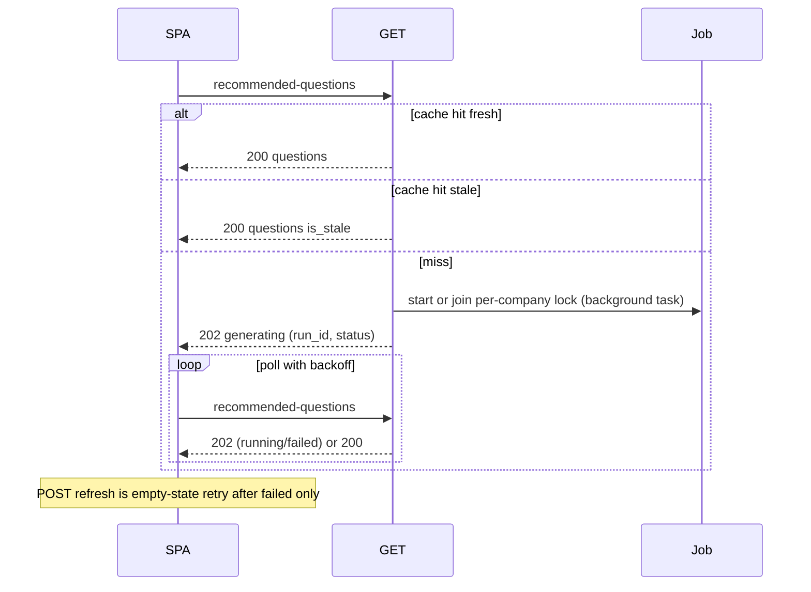

# ADR 0018 — Recommended questions worker graph + fill contract

- **Status:** Accepted
- **Date:** 2026-08-24
- **Supersedes:** —
- **Related:** [ADR 0003](./0003-confirm-without-llm.md) (Confirm stays HTTP); [ADR 0009](./0009-research-gate-and-tavily-ingest.md) (Tavily is ingest, persist to PG); [ADR 0007](./0007-admin-trace-viewer.md) (session node-steps stay session-scoped); [ADR 0011](./0011-knowledge-commit-without-llm.md) (org catalog commit stays HTTP)

## Context

Landing recommended questions are a ~12h cache produced by one cheap `complete_json` over recent Google Trends HK titles ([`internal/perception/question_generator.py`](../../internal/perception/question_generator.py)). `GET /api/companies/{id}/recommended-questions` is read-only: no row → 404; expired row → 200 + `is_stale` ([`cmd/api/routes/questions.py`](../../cmd/api/routes/questions.py)). The only fill path is the scheduler clock ([`cmd/scheduler/main.py`](../../cmd/scheduler/main.py)). If the clock has not run, ingest failed, or the company was created after the last tick, the landing cards stay empty.

Trends is a single source (`google_trends_hk`). Scoring is HK-wide recency (`list_top_signals(..., region="HK")`), not company voice, audience catalog, or products. Session already has Tavily ingest ([ADR 0009](./0009-research-gate-and-tavily-ingest.md)), product retrieve, and `voice_pack` / `roast_level` — the question worker does not reuse them.

Constraints that must not move:

- LangGraph **session** graph stays the chat LLM zone. ROADMAP already excludes `question_generator` from that graph.
- Confirm / org catalog commit stay traditional HTTP ([ADR 0003](./0003-confirm-without-llm.md), [ADR 0011](./0011-knowledge-commit-without-llm.md)).
- Knowledge stays PostgreSQL. Tavily/Trends are ingest adapters into `raw_news_events`, not a second store ([ADR 0009](./0009-research-gate-and-tavily-ingest.md)).

## Decision

### 1. Boundaries

1. **Not the session graph.** Question generation is a dedicated **worker LangGraph**. A run must not `start` a session, Confirm/publish, or upsert org catalog. Clicking a card remains `sendMessage` into a session.
2. **Knowledge stays PostgreSQL.** Trends and Tavily persist as `raw_news_events` (existing provenance). No parallel cache/index for question facts.
3. **LLM zone is the worker graph only.** HTTP Confirm and Approvals stay zero-LLM.

### 2. HTTP fill contract

Full research far exceeds a landing spinner (the multi-node graph takes tens of seconds, so a synchronous wait would almost never hit). GET miss **starts** fill in the background and answers **202 immediately** — there is no in-request wait window.

| Case | Behaviour |
|------|-----------|
| GET, row exists, not expired | 200 as today |
| GET, row exists, expired | 200 + `is_stale: true`. **Do not** auto-run the graph (avoids surprise cost on every landing) |
| GET, no row | Start or **join** the in-flight run for that `company_id` as a **background task**; respond **202** immediately with a small generating body (`run_id`, `status`, `retry_after_seconds` — extend [`schemas/perception.py`](../../schemas/perception.py); not a 404). SPA keeps loading and **polls GET** with backoff |
| GET, no row, last run `failed` | 202 body with `status: failed` so the SPA can show an error note + retry CTA (POST refresh) instead of an infinite spinner |
| POST `/api/companies/{id}/recommended-questions/refresh` | Force a new run even if cache is valid (dedupe if one already in-flight). Same 202 pattern. **Landing uses this only as the empty-state retry after `failed`.** Expired cache stays 200; the scheduler (or CLI `--force`) does routine replacement. Not a user-facing “refresh these cards” control. |

- **Background execution:** the graph runs as a task decoupled from the request handler (no awaiting a long graph inside a uvicorn worker). **“Join” means polling `question_runs` in PostgreSQL, never in-memory futures** — the contract must hold with multiple API workers.
- **Run status contract:** `question_runs.status` = `running | succeeded | failed`; `failed` is terminal and surfaced via the 202 body.
- **Stampede:** one active run per company (Postgres advisory lock). A **global semaphore** additionally caps concurrent graph runs so the scheduler fan-out (N companies × deep graph at one tick) does not burst LLM + Tavily cost. Scheduler invokes the **same** graph + lock; it is refresh, not the only fill.
- **Cadence:** per-company **jitter** (hash of `company_id`) staggers the 12h tick; `question_cache_ttl_hours` must exceed the scheduler interval (13h vs 12h) so cache does not expire just before the tick.
- **New company:** first landing GET is the fill trigger. Register-time enqueue is optional later, not required here.
- Authorized members no longer get 404 “run the question-generator worker” as the empty contract.

### 3. Worker LangGraph

- **Purpose:** ordered nodes + admin trace. **Not** interrupt/resume — no Stop, no `approval_token`, no user-facing thread resume.
- **Each run is a fresh invoke** (`thread_id` / run id = new UUID). Do **not** use `company_id` as a durable checkpoint thread (a failed mid-run must not resume into a later GET).
- **Checkpointer:** optional/off for v1. Persistence is `recommended_questions` + trace tables, not graph state.
- **State** is company-scoped (profile, voice, audience, products, signal shortlists) — not session `SessionState`.

Node names are locked as the pipeline contract; prompt/threshold internals may tune without a superseding ADR unless HTTP or “not session graph” changes:

| Node | Job |
|------|-----|
| `ensure_signals` | If HK corpus is empty/too thin, run hot-search ingest (Trends + RSS). Never fail the run solely because the scheduler clock has not ticked |
| `cheap_screen` | Score Trends/RSS vs the **company fingerprint** (name tokens + profile + catalog product names + audience hooks); drop “全港都搜但品牌無橋”. Cold start ladder: fingerprint → one-off cheap LLM infer cached in `profile.inferred_category` (never overwrites human-written fields) → recency diversity shortlist with low quality flag. A missing profile never fails the run |
| `shallow_research` | Shortlist: one hop Tavily∪PG per candidate (reuse ADR 0009 ingest adapter; persist `raw_news_events`) |
| `filter` | Keep followable + product-bridgeable; drop high-risk. **Named-org roast is blocked deterministically** — match trend titles against PG entity names (orgs/brands) before any LLM judgement; also drop pure celebrity with no scene |
| `deep_research` | 5–8 survivors: scene, emotion, constraints (VOICE: 抽人性唔抽機構) |
| `product_match` | Same retrieve rules as session (org wins SKU); **read-only** — no catalog upsert |
| `compose_questions` | 5–7 zh-HK questions; inject `voice_pack` / `roast_level`; bind real `source_signal_ids` (no round-robin fake refs); **dedupe against question texts / trend combos served in the last N days** (query past `recommended_questions` rows — no separate history table) |

**Soft-fail:** Tavily/LLM miss still compose from screened Trends, but mark quality (same idea as ADR 0009 `signals_trusted`) so rationale does not lead untrusted facts. Prefer showing cards over an empty landing.

**Scheduler:** `hot_search` stays its own clock. The question graph may call `ensure_signals` so questions do not depend on tick order.

### 4. Sources and audience

- **Google Trends HK** stays **timing fuel**, not the definition of audience.
- **RSS news feeds** (this ADR) join Trends as zero-key timing fuel — Google News RSS HK plus local media feeds ingest into `raw_news_events` via the same adapter pattern (per-feed isolation, dedupe by id/url, own fetch interval). RSS items carry real `url`s, which makes `shallow_research`'s one hop cheaper. **YouTube Data API is explicitly deferred** — it is the only keyed source and is not needed for v1.
- **Tavily** (this ADR) is the second hop to explain a trend and find a scene; always persist.
- **Meta / platform-native** stays ROADMAP Phase 3 — future source, not shipped here.
- **Audience** comes from company `voice_pack` + `audience_catalog` + catalog products, not `region=HK` recency. `list_top_signals` remains a shared corpus; **filter is per-company**.

### 5. Observability

`session_node_steps` is session-FK’d ([ADR 0007](./0007-admin-trace-viewer.md)). Do **not** overload Session Trace.

- New **`question_runs`**: `company_id`, `run_id`, status (`running | succeeded | failed`), trigger = `get_miss` | `refresh` | `scheduler`, quality flags, error, started/finished timestamps.
- Node I/O: dedicated **`question_node_steps`** (mirror of session steps) so `cheap_screen` / `filter` (non-LLM) are visible. `llm_call_records` keep `caller=node:question_*` + `company_id`.
- Admin: list runs by company, **with aggregated tokens/cost per run from `llm_call_records`** — this graph is the most expensive background job so far and its cost must be inspectable. Platform admin, not a tenant debugger. A System tab is implementation, not required to lock this ADR.

## Consequences

- SPA: treat 202 + poll GET with backoff and a max-attempt cap; show a generating state instead of a vanishing section; a `failed` run shows an error note + retry CTA (POST refresh). Expired cache stays on screen until the scheduler tick — no stale chip, no landing force-run. Rationale on cards should be zh-HK or omitted (today’s English strategist line is not the contract).
- Cost: miss + ~12h staggered scheduler; POST refresh only for failed-empty retry (and CLI). Per-company lock + global semaphore. Empty GET no longer waits on the next clock.
- Session handoff (optional, separable): `POST /api/sessions/{id}/messages` may accept `source_question_id` so the first turn reuses the question's `source_signal_ids` research instead of re-searching; the click target remains `sendMessage`.
- Graph/prompt tuning of screen/filter does not need a new ADR unless the HTTP fill contract or session-graph boundary changes.
- Tests: mock LLM/Tavily like session nodes; GET miss without signals still attempts `ensure_signals`; the old 404 empty-contract test is rewritten into the 202/poll contract.
- Out of this ADR: register-time enqueue (duplicate of first GET); Redis (ROADMAP Phase 4 — PG lock is enough); Meta ingest; YouTube Data API (only keyed source, deferred).
