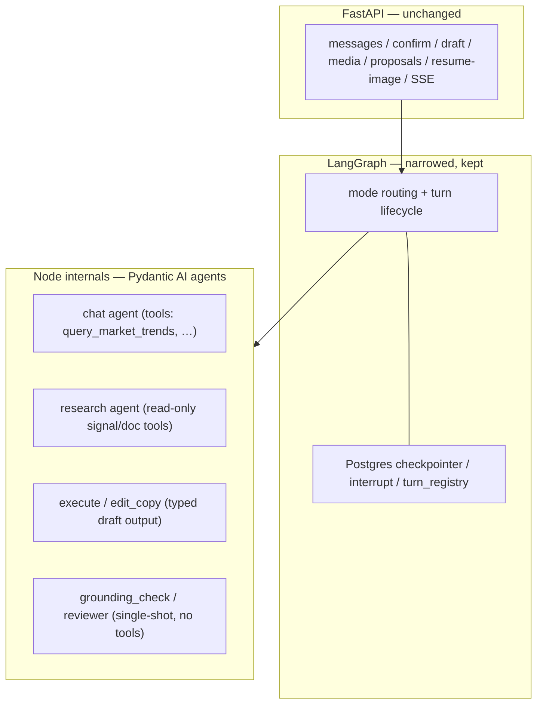

# ADR 0019 — Pydantic AI inner harness; session graph narrows to mode/lifecycle layer

- **Status:** Accepted
- **Date:** 2026-08-29
- **Supersedes:** —
- **Related:** [ADR 0002](./0002-rest-source-of-truth-sse-enhancement.md) (REST SSOT + SSE dedupe unchanged); [ADR 0003](./0003-confirm-without-llm.md) (Confirm stays HTTP, never a tool); [ADR 0004](./0004-stop-discard-and-image-resume.md) (Stop → harness abort; park/resume shape); [ADR 0009](./0009-research-gate-and-tavily-ingest.md) (document ingest uses the existing PG plane); [ADR 0011](./0011-knowledge-commit-without-llm.md) (catalog upsert stays HTTP, never a tool); [ADR 0016](./0016-queue-send-while-turn-in-flight.md) (in-flight queue unchanged)

## Context

Every LLM node in the session graph ([`internal/session/nodes.py`](../../internal/session/nodes.py)) is a single-shot `complete_json` / streaming-text call: no tool loop, no intermediate steps, context assembled by hand per node. The inner agent loop — tool calling, cancellation, context management — is where the remaining product upside lives (chat, research, post execute/revise). We do not want to build and maintain that loop (plus MCP and skill loading) ourselves.

The graph itself is **not** premature: it already carries paid-for product capability — Postgres checkpointer, image interrupt/park with `POST /resume-image`, `turn_registry`, Stop-discard semantics, and the in-flight send queue ([ADR 0016](./0016-queue-send-while-turn-in-flight.md)). Ripping it out to "add it back later" would be a rewrite, not a simplification. The correct move is to **narrow** the graph to what it is good at (mode routing + turn lifecycle) and buy the inner loop.

User approval already exists in three places, all with the same shape — **park/pending → HTTP decision → zero-LLM execution**:

| Mechanism | Shape |
|-----------|-------|
| Publish confirm ([ADR 0003](./0003-confirm-without-llm.md)) | `approval_token` per preview revision → `POST /sessions/{id}/confirm` → adapter + `tool_receipts` + SSE `confirm.completed`. No deny: not clicking Confirm is the no; Stop discards the turn |
| Catalog proposals ([ADR 0011](./0011-knowledge-commit-without-llm.md)) | `POST …/proposals/{id}/approve|reject|cancel` — approve upserts the org product; non-pending → 409 |
| Image park/resume ([ADR 0004](./0004-stop-discard-and-image-resume.md)) | graph interrupt parks; `POST /resume-image` resumes with an explicit payload |

The agent loop today has **no** mid-turn tool approval, because there are no tools.

Constraints that must not move:

- Confirm / `publish_social_post` / org catalog upsert stay traditional HTTP — never MCP tools or harness tools the model can fire ([ADR 0003](./0003-confirm-without-llm.md), [ADR 0011](./0011-knowledge-commit-without-llm.md)).
- Knowledge stays PostgreSQL only; no parallel doc/RAG store.
- Stop must abort in-flight work; REST stays the source of truth, SSE an enhancement layer ([ADR 0002](./0002-rest-source-of-truth-sse-enhancement.md)).
- CI gates mock the LLM; no live key required ([docs/TESTING.md](../TESTING.md)).

## Decision

### 1. Layers

- **FastAPI: unchanged.** Confirm/publish, catalog propose/approve, media upload, `resume-image`, SSE — all stay HTTP.
- **LangGraph: narrowed but kept.** Mode routing, Postgres checkpointer, image interrupt/park, turn lifecycle. Not optional, not removed.
- **Pydantic AI: the inner loop where a loop pays.** **Narrow agents built per stage** — each agent registers only that stage's tools, so the allowlist is "the tool does not exist", not a filter. `output_type` maps directly onto the Pydantic models in [`schemas/`](../../schemas/) (canonical draft, chat reply), preserving the structured-I/O contract. BYOK/LiteLLM routing stays as-is. `grounding_check` and `reviewer` remain single-shot structured calls — an agent loop there only adds variance and cost.

Rejected: LangChain `create_agent` (a second, nested graph semantics inside our graph — state ownership gets ambiguous); OpenAI / Claude Agent SDK (provider gravity points against BYOK; Claude SDK ships a coding-agent tool surface); Agno/AgentOS (a second control plane); Pi (TypeScript — would fork the `schemas/` source of truth and the checkpointer across languages); Deep Agents (shell/filesystem defaults are a liability here).

### 2. Dangerous operations are never tools

`publish_social_post`, Confirm, and org catalog upsert are **not registered as tools** (restating [ADR 0003](./0003-confirm-without-llm.md) / [ADR 0011](./0011-knowledge-commit-without-llm.md) with the harness in place). The technical reason, beyond the product one: an aborted tool call can leave half-written state, so only **read-only** tools belong in a cancellable loop. A publish fired mid-loop and then Stopped is exactly the failure mode the HTTP Confirm boundary exists to prevent.

### 3. Approval stays outside the loop

- **v1 does not use the harness's deferred/approval-required tool mechanism.** Every in-loop tool is read-only (`query_market_trends`, document extract, signal queries), so there is nothing to approve inside the loop. The things that need approval are not tools (§2).
- If a future tool ever needs a human decision (paid API, scheduling), the decision **must not** travel through chat text. It follows the existing skeleton: **graph parks (interrupt) → a dedicated HTTP POST carries approve/deny → resume with the decision payload** — the same shape as Confirm, proposals review, and `resume-image`. The model never touches the approval decision; the decision path stays zero-LLM.
- Deny semantics follow current convention: deny = do not resume, or an explicit reject endpoint; the parked state stays inspectable. The model never "decides to retry" an approval on its own.

### 4. Documents (PDF/DOCX later) are tools, not core

- Tool input is an `attachment_id` only. The tool's internals fetch parsed text over HTTP from a document service; the core loop never ships a PDF parser, OCR, or chunker.
- Full text lands in the existing PostgreSQL ingest plane ([ADR 0009](./0009-research-gate-and-tavily-ingest.md)) — not a new knowledge store. Tools return slices/summaries/references, never whole documents.
- Small, provider-supported PDFs may optionally travel as native multimodal message parts; long PDFs / OCR / tables / xlsx always go through tools. Skills (`SKILL.md`) load through a small prompt-assembly helper — we do not bet on any framework's skills roadmap.

### 5. Migration is incremental, spike first

Per-node adoption, starting with the `chat` node on the same change set as this ADR:

- **Scope:** the `chat` node only — one narrow agent with `query_market_trends` plus a test-only mock slow tool (`asyncio.sleep`).
- **Four seams to validate:** (a) harness event stream → existing SSE delta contract with dedupe behaviour unchanged ([ADR 0002](./0002-rest-source-of-truth-sse-enhancement.md)); (b) Stop → `aclose()` → LiteLLM connection teardown, no half-written session state when cancelled mid-tool (same best-effort abort semantics as [ADR 0004](./0004-stop-discard-and-image-resume.md)); (c) CI runs with `TestModel`, no live key, coverage gates in [docs/TESTING.md](../TESTING.md) do not drop; (d) allowlist isolation — the chat agent cannot see publish-class tools because they are never registered.
- **Convergence bar:** if the SSE adapter cannot converge within roughly 200 lines, fall back to the reduced variant (harness on research only; chat stays single-shot) and record the outcome in a follow-up ADR.

## Consequences

- Agent objects are constructed and disposed **inside node functions only**; they must not leak into FastAPI handlers or graph state (keeps the lock-in surface at the tool-signature + `output_type` pattern shared by all Python harnesses).
- Chat harness turns are recorded with `recorder.track` around the agent run ([ADR 0005](./0005-platform-levels-and-llm-records.md)): one `chat_text` row per turn covering the whole tool loop (inner completions are not separate rows). Correlation still comes from `graph.py` `call_context(caller=node:chat)`. Remaining `complete_json` / `complete_text` / `astream_text` nodes stay on the router choke point.
- New API/SSE fields introduced by the event-stream adapter extend [`schemas/`](../../schemas/) per convention; no ad-hoc dict payloads.
- Explicitly out of scope: removing or replacing the checkpointer; introducing an MCP-server control plane; any publish-class tool; a document RAG store; harness tool-approval in v1 (future need → park → HTTP → resume per §3).
- `ROADMAP` and per-node prompt internals may tune without a superseding ADR; changing the layer boundaries, the no-publish-tool rule, or the approval shape requires one.
- This ADR locks direction and boundaries, not a two-PR split: the `chat` spike (including the `pydantic-ai` dependency) lands with the decision.
- `pydantic-ai-slim` is installed **without** the `openai` extra: that extra wants `openai>=3`, which conflicts with LiteLLM's `openai<3`. Live chat uses `OpenAIChatModel` + `OpenAIProvider` on the openai 2.x client already pulled by LiteLLM.
