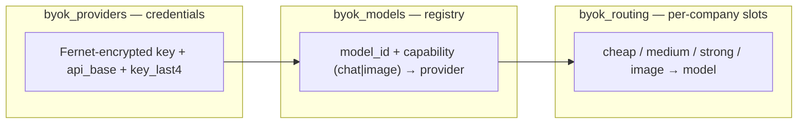

# ADR 0020 — Org BYOK: provider keys, model registry, per-tier routing

- **Status:** Accepted
- **Date:** 2026-08-30
- **Supersedes:** ROADMAP's `byok_config` single-table placeholder (replaced by the three-table split in §2)
- **Related:** [ADR 0005](./0005-platform-levels-and-llm-records.md) (`llm_call_records` gains `key_source` / `key_last4`); [ADR 0010](./0010-org-membership-invites-and-shared-assets.md) (owner/admin editor roles gate BYOK management); [ADR 0019](./0019-pydantic-ai-inner-harness.md) (the Pydantic AI harness consumes the same credential resolver as the LiteLLM router)

## Context

BYOK today is **env-only**: `OPENAI_API_KEY` / `ANTHROPIC_API_KEY` / `LLM_API_BASE` / `LLM_*_MODEL` in [`internal/config.py`](../../internal/config.py). That works for a single-tenant deployment but not for a multi-org product:

1. **Credentials are process-global.** `configure_litellm()` mutates `litellm.openai_key` / `litellm.anthropic_key` module globals; `has_llm_credentials()` is a global boolean. Two orgs on one deployment cannot use different keys.
2. **Two resolution paths.** The LiteLLM router ([`internal/llm/router.py`](../../internal/llm/router.py)) and the Pydantic AI harness (`live_harness_model()` in [`internal/session/harness.py`](../../internal/session/harness.py)) each read `settings` directly and each encode provider detection. Per-org resolution must exist **once** and be consumed by both.
3. **Key passing is inconsistent.** `_base_kwargs` only attaches `api_key` when `LLM_API_BASE` is set; other paths rely on the global mutation.

Two things make this tractable:

- **The API surface is already BYOK-friendly.** Everything runs on Chat Completions + Images API (no Responses API), which every OpenAI-compatible provider implements. `litellm.drop_params = True` silently drops our two OpenAI-specific assumptions (`response_format: json_object`, `stream_options.include_usage`) for stricter providers — **that flag is the compatibility backstop and must not be removed**.
- **`llm_call_records` already carry `company_id`** ([ADR 0005](./0005-platform-levels-and-llm-records.md)), so per-org cost attribution needs no new plumbing.

Prior art checked (2026-08-30): **Cline/Roo Code** (provider → key → model dropdown fetched from OpenRouter `/models`, cached, capability from `architecture.modality`); **LibreChat** (`models.fetch` against user-supplied base URLs — their bug history is where the SSRF guard and per-principal cache scoping below come from); **Dify** (multi-tenant workspace SaaS: provider-level credentials shared across models, custom models with own credentials, "Default Models" per job category, owner/admin-only, validate-on-save, attach-instead-of-duplicate). Dify's shape independently confirms the three-layer design.

Full review, API table, and UI flow: [docs/BYOK_PLAN.md](../BYOK_PLAN.md).

## Decision

### 1. Three decoupled layers — keys / models / routing

A model is registered **once** against a key; tiers are pure pointers. One model may serve multiple slots (`cheap = medium = deepseek-v4-flash`) without re-entering credentials. Routing slots are **four fixed FK columns** matching `ModelTier` + image — a new tier is a code change anyway (`NODE_MODEL_TIERS`, prompts, cost profiles), so JSONB flexibility buys nothing and FK integrity is worth more. Chat slots must reference `capability=chat` rows; the image slot a `capability=image` row. **That capability match is app-level** (`PUT /routing` validation + resolver skip-to-env on mismatch in `_slot_from_model`). Postgres cannot put a constant in a foreign key without extra capability columns or a trigger; we do not add those. Enum-like columns (`provider_type`, `capability`, `capability_source`) and “`api_base` required when `openai_compatible`” **are** CHECK-constrained.

### 2. Encryption at rest

- Fernet with a new env `BYOK_ENCRYPTION_KEY`; `cryptography` promoted to a direct dependency. `app_env=production` refuses to boot without it (same posture as `JWT_SECRET`).
- Raw keys are never logged, never serialized to API/SSE/OpenAPI, never in `llm_call_records`. Records and the UI carry `key_last4` only.
- Key rotation is deferred: rotating the KEK means re-saving all rows.

### 3. One resolver, consumed by both LLM paths

- `resolve_llm_model(company_id, tier)` / `resolve_image_model(company_id)` return a `ResolvedModel(model_id, api_key, api_base, provider_type, source: "org"|"env", key_last4)`: routing slot → registry row → provider row (decrypt); NULL slot / no row / no company → env default.
- `company_id` is scoped per turn via `contextvars` (same pattern as the recorder's `call_context`); graph nodes stay untouched.
- The router passes explicit per-call `api_key` / `api_base` kwargs and **stops mutating `litellm` globals on the org path**; `live_harness_model()` consumes the same resolution.
- **Env behavior stays bit-identical when no org rows exist**; the refactor lands with tests before any API/UI.

### 4. Env keys stay as per-slot platform fallback

A NULL slot falls back to the platform env key for that tier — orgs can override `strong` only and keep `cheap/medium/image` on the platform. Env keys also keep dev / eval CLI / onboarding working unchanged. Controlling platform-key cost is a future per-org quota concern, not a fallback-granularity concern. Strict opt-out (org forbids env fallback) is deferred.

### 5. Editor-only visibility

All BYOK endpoints and the UI tab are gated by `require_company_settings_editor` (owner/admin, [ADR 0010](./0010-org-membership-invites-and-shared-assets.md)). Members see nothing — not even an `is_configured` boolean — in v1.

### 6. Delete is two-phase: block, then confirmed force

`DELETE` without `force` returns **409 + the dependent list**; the UI shows a confirm dialog; `DELETE ?force=true` cascades. Deleting a key cascades its registered models and nulls referencing routing slots; deleting a model nulls referencing slots. Both force responses report exactly what was removed/cleared.

### 7. Model id source is a hybrid fetch

After a key is entered, the UI tries the provider's model list (`GET /providers/{id}/models` proxy): fetch succeeds → searchable combobox (typing filters the list; a typed id is valid even if it is not listed), and **capability comes from provider modality metadata when available**; fetch unsupported/fails → same combobox with no suggestions + inference pre-fill (`dall-e` / `seedream` / `flux` / `imagen` → image, else chat) + manual override. Capability is **never auto-probed with live calls** (image probes cost money). Model lists are format-validated, not live-revalidated per message (LibreChat's lesson).

### 8. SSRF guard on user-supplied base URLs

`api_base` is user input and the server fetches it (model-list proxy, test probes). A shared HTTP helper blocks private/internal/link-local ranges (`127.0.0.0/8`, `10.0.0.0/8`, `172.16.0.0/12`, `192.168.0.0/16`, `169.254.0.0/16`, `::1`, …), pins the validated address through the request (DNS-rebinding safe), enforces a hard timeout, does not follow redirects to unvalidated targets, and forwards no ambient headers. This is a P0 security prerequisite, not polish.

### 9. Model-list cache is scoped per provider row

Never a global cache keyed by base URL alone — one org's key-gated model list must not leak to another org (LibreChat shipped this bug). Cache key = provider row id; short TTL; never persisted.

### 10. Save queues a background probe

Saving a key or model is non-blocking (shape validation only) and queues a background auth/format probe; the verified badge updates without the user pressing Test (Dify validates on save; we keep save fast and probe async). Manual Test endpoints stay for re-checks and are rate-limited.

### 11. Add-model dedupe attaches

`POST /models` with an existing `(provider_id, model_id)` updates that row (e.g. capability correction) instead of 409 or a duplicate.

### 12. UI: three unmixed surfaces, no wizard

Editor-only `?tab=models` in company settings. Add key, Add model, and Routing are three unmixed surfaces. Each layer is its own action: save closes; nothing offers the next layer. There is no wizard, no page-header create chrome, and no row-level create.

- **Add key** (Keys heading) — key-only dialog (label, type, secret, `api_base` when compatible). Save closes. No "add a model now".
- **Add model** (Models heading) — single-page dialog: model id (searchable combobox over the provider list, or free text when unfetchable) + capability (pre-filled, overridable). Requires an existing key (button disabled until one exists). One key is used automatically; multiple keys show a Key field on the same form. Save closes. Never creates a key; never opens routing.
- **Routing** — four slot dropdowns on the page, filtered by capability, showing effective source ("Company: fable-5" vs "Platform default"). Clearing a slot reverts that slot only. This is the only place slots are assigned.

Credential dialogs (add key, add model, edit/rotate key): overlay click does not dismiss; X / Esc do. Validation and save errors render **inside** the dialog.

## Consequences

- One Alembic hex revision adds `byok_providers` / `byok_models` / `byok_routing`; ROADMAP's `byok_config` row is updated to match.
- The resolver refactor touches `internal/llm/router.py`, `internal/session/harness.py` (plus research/execute harnesses through it), and the `has_llm_credentials()` call sites; CI gates keep mocking at the same seams — no live key required ([docs/TESTING.md](../TESTING.md)).
- Question-graph worker fan-out resolves per company; one org's bad key must not fail other orgs' runs.
- `llm_call_records` gains `key_source` (`env`|`org`) + `key_last4` (nullable).
- New routes under `/api/companies/{id}/byok/…` with schemas in `schemas/byok.py`; contracts + TS mirrors regenerated per convention.
- Explicitly deferred: KEK rotation tooling, strict env opt-out, platform-key per-org quotas, Responses API adoption (would need an `OpenAIResponsesModel` branch + degrade strategy — separate ADR).
- Changing the layer boundaries (§1), the fallback semantics (§4), the visibility rule (§5), or the no-raw-key rule (§2) requires a superseding ADR; endpoint shapes, probe cadence, and UI arrangement may iterate without one.
